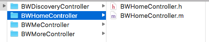

# BWiOSDevelopmentTools
iOS开发工具，Objective-C语言

Github：https://github.com/bobwongs/BWiOSDevelopmentTools

## 目录

- 开发工具
- 设计
  - 类文件模板的公共参数
  - MVC文件和代码的生成器设计
  - Property的Getter和Setter方法的生成器
  - 接口文件的生成器
- 实现
- 运用
- 优化方向
- Follow Me

## 开发工具

避免开发过程中重复性的工作，减少人为的失误，提升开发效率；

开发经验形成的一套开发模板，通过生成模板文件和代码，进行高效的项目开发。

## 设计

### 类文件模板的公共参数

项目名、版权名、开发者、导入文件、基类、日期

文件路径名称、文件名

### MVC文件和代码的生成器设计

#### 设计理念

> Xcode中的iOS项目本身就是设计成MVC模式的，因此创建和编写Controller、Model、View都是在iOS功能界面的开发中很频繁的操作，而且每次创建文件和编写代码都有很多重复性的工作，如Controller的Title设置，在此通过一个文件的配置，脚本去该文件中解析和提取字符串信息，生成文件和模板代码，可以很大程度上提升开发效率。

#### 模板文件和代码

MVC目录：Controller、Model、View

Controller的模板代码，在此为个人常用的模板代码，可以依据个人喜好进行修改

配置参数设计：

> Controller：Name、Title、Comment

> 优化：强化头文件导入配置、导航条配置、TableView配置

数据源文件格式：

示例：

VC: Home Title: HomeTitle Comment: HomeComment
VC: Discovery Title: DiscoveryTitle Comment: DiscoveryComment
VC: Me Title: MeTitle Comment: MeComment
VC: More Title: MoreTitle Comment: MoreComment

生成：

### Property的Getter和Setter方法的生成器

#### 设计理念

> 为Property快速生成Getter和Setter方法，也可以为UI生成setUI和基于Masonry的setConstraints方法

#### 模板代码

Getter方法

UI对象快速创建模板代码

Masonry布局模板代码

配置参数设计：

> Objective-C Property的声明

### 接口文件的生成器

#### 设计理念

> 有些项目，接口设计为，每个接口都是一个类，而且要对接口链接进行宏定义，这些是创建一个接口都需要的步骤，所以通过开发工具，只要在源文件做好配置就能快速生成文件和项目代码，之后直接导入接口文件进入项目和拷贝宏定义接口代码到项目接口配置文件中

#### 模板文件和代码

接口文件

接口宏定义代码

配置参数设计：

> URL、类文件名称、注释、接口宏定义命名

## 实现

### 操作

字符串的准确匹配和截取

文本的动态拼接

文件的创建

在文件中编辑文本

### 技术选用

Python脚本、Mac OS应用开发、Yeoman

当前Demo使用Python脚本来制作生成器，后续会研究Mac OS应用开发来作为开发工具

## 运用

在项目开发中使用，使用Python运行脚本，传一些配置参数，生成到目标文件中，之后进行导入到项目中或者拷贝代码到项目文件中。

## 优化方向

脚本参数配置项设置，增加脚本的参数配置项，让生成器更加强大；

开发Mac OS工具程序，进行快速的生成；

iOS Xcode项目脚本生成，只需要配置一些参数，就可以把基础性的配置和代码编写好；

## Follow Me

Github:[https://github.com/bobwongs](https://github.com/bobwongs)

简书: [http://www.jianshu.com/users/9d21ec83358a/top_articles](http://www.jianshu.com/users/9d21ec83358a/top_articles)